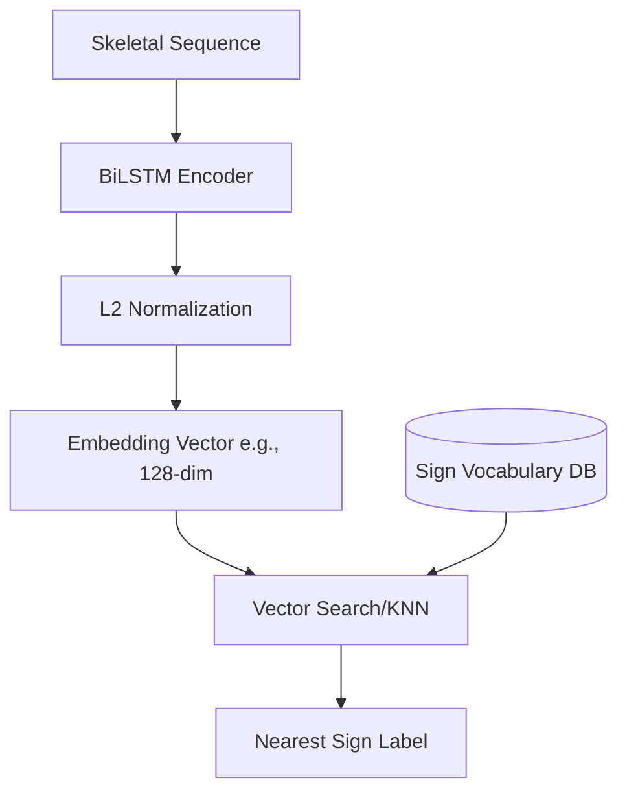

# SignBridge: Production-Readiness & Architectural Analysis

This roadmap outlines key architectural enhancements to transition the SignBridge prototype into a robust, enterprise-grade production application. It specifically addresses how to dynamically expand the vocabulary (adding new signs) without retraining the model from scratch, along with professional software engineering practices.

---

## 1. The Dynamic Vocabulary Challenge: Adding Words Without Retraining

Currently, the model uses a fixed **Softmax classification layer** of 22 classes. Adding a 23rd word requires updating the model architecture, labeling new videos, and retraining the network from scratch. 

To make SignBridge enterprise-ready, you can transition from **direct classification** to **metric learning** or use **transfer learning / dynamic heads**. Below are the three primary strategies.

### Option A: Metric Learning (Siamese / Triplet Loss + Vector Database) - *Recommended*

Instead of training the model to output a specific class probability, you train a neural network to output a high-dimensional vector representation (embedding) of the sign.

1. **How it works:**
   - Modify the training objective using **Triplet Loss** or **Contrastive Loss**. The network learns to project similar signs close together and dissimilar signs far apart in the embedding space.
   - Maintain a localized vector database (e.g., FAISS, Qdrant, or even a simple NumPy matrix of average prototypes).
2. **Adding a new word:**
   - Record 3 to 5 videos of the new sign.
   - Extract landmarks, run them through the frozen encoder, and compute the average embedding (the "prototype" vector) for the new class.
   - Register this prototype and label in the database.
   - **Zero retraining required.**
3. **During Inference:**
   - Pass the live user's gesture sequence through the encoder.
   - Calculate the cosine similarity between the output embedding and the registered prototypes. The class with the highest similarity is predicted.

---

### Option B: Frozen Backbone with Dynamic Classification Head (Transfer Learning)

If you prefer to keep a classification model, you can freeze the feature extraction layers and only train the classification layers.

1. **How it works:**
   - Separate the model into a **feature extractor** (recurrent/dense layers up to the penultimate layer) and a **classification head** (the final Dense layer).
2. **Adding a new word:**
   - Expand the final output dimension by 1 (e.g., from 22 to 23).
   - Freeze all weight parameters in the LSTM layers.
   - Feed the new word's training samples plus a small, balanced subset of old classes (to prevent catastrophic forgetting/bias) into the model.
   - Retrain **only the classification layer** for 5–10 epochs.
3. **Pros/Cons:**
   - Training takes seconds instead of hours, but it still requires a runtime training loop and model recompilation.

---

### Option C: Dynamic Time Warping (DTW) with Coordinate Trajectories

A classic, non-machine-learning approach for sequence comparison.

1. **How it works:**
   - Compute the temporal alignment distance between the normalized 3D trajectories of the input sign and reference signs.
2. **Adding a new word:**
   - Simply save the coordinate sequence of a single template video in a folder.
3. **Pros/Cons:**
   - 100% explainable and zero training.
   - However, DTW scales poorly with vocabulary size (latency increases linearly with the number of words) and is less robust to variations in signing styles than deep networks.

---

### Comparison Matrix

| Criteria | Classic Retraining (Current) | Metric Learning (Siamese + Vector DB) | Dynamic Class Head (Fine-Tuning) | Dynamic Time Warping (DTW) |
| :--- | :--- | :--- | :--- | :--- |
| **Retraining Needed?** | Yes (Full model) | **No** (Only embed database update) | Yes (Final dense layer only) | **No** (Zero training) |
| **New Word Insertion Time** | Hours (High compute) | **Instantly (< 1 sec)** | Seconds | **Instantly** |
| **Data Requirements** | 100+ videos per class | **3–5 template videos** | 20–30 videos + past data | **1 template video** |
| **Inference Latency** | Low (O(1)) | Low (O(log N) via Vector DB) | Low (O(1)) | High (O(N) search) |
| **Robustness to Signer** | High | High | Medium-High | Low |

---

## 2. Enterprise & Production-Readiness Roadmap

To elevate SignBridge from a prototype to a secure, fast, and scalable production system, implement the following architectural enhancements.

### A. Model Serialization & Optimization (Ditching `.npy` Weights)
Currently, weights are loaded from `.npy` files and injected into a rebuilt Keras architecture.
* **Why it's a bottleneck:** Rebuilding architectures dynamically is error-prone, depends heavily on the exact versions of Keras/TensorFlow, and has a slow cold start.
* **Production Solution:**
  1. Save your models as standard **HDF5 (`.h5`)** or **SavedModel** formats using `model.save()`.
  2. For deployment, export the model to **ONNX (Open Neural Network Exchange)** or **TensorFlow Lite (TFLite)**. 
  3. ONNX/TFLite runtimes are lightweight, run up to **3x-5x faster** on CPU/Edge devices, and eliminate the need to install the massive ~500MB TensorFlow package on your production server.

### B. Decoupled, API-First Architecture
Streamlit is excellent for internal validation but does not scale well to hundreds of concurrent users.
* **Production Solution:**
  * **Backend API (FastAPI):** Develop a separate API using FastAPI to handle landmark extraction, sequence preprocessing, and model inference.
  * **Frontend (React / Next.js):** Build a responsive, user-friendly UI that communicates with the backend via REST or WebSockets.
  * **MediaPipe on the Client:** Perform landmark extraction **on the user's browser** using MediaPipe's JavaScript SDK. Instead of uploading heavy raw video files to your server (which drains bandwidth and causes high latency), the frontend extracts the coordinate arrays locally and sends only a lightweight JSON/binary array to the FastAPI server for prediction.

### C. Real-Time Streaming via WebRTC
Uploading video files does not fit real-time usage (e.g. a hotel counter kiosk).
* **Production Solution:** Implement **WebRTC** to stream frames from the client webcam. The backend or frontend client processes the stream frame-by-frame, performs segmentation dynamically using a sliding window, and translates continuous speech with minimal delay.

### D. Professional Code Quality & Infrastructure
* **Configuration Management:** Move hardcoded configurations (like `SEQUENCE_LENGTH`, indices, and thresholds) out of code files and into a `config.yaml` or a Pydantic `BaseSettings` object.
* **Structured Logging:** Replace `print` statements with Python’s `logging` library configured to output structured JSON logs (vital for APM tools like Datadog, ELK, or AWS CloudWatch).
* **Robust Exception Handling:** Wrap key stages (video reading, landmark extraction, and inference) in detailed `try-except` blocks with meaningful user-facing errors.
* **Unit Testing (`pytest`):** Add unit tests for critical mathematical utilities, such as `normalize`, `interpolate_missing`, and `pad_or_truncate`.
* **CI/CD & Containerization:** Write a `Dockerfile` to package the application. Setup GitHub Actions to run automated linting (e.g., `ruff`) and unit tests on every pull request.

---

## 3. Next Actions & Discussion

To begin transitioning SignBridge towards this production state, we should focus on these high-impact milestones:

> [!NOTE]
> 1. **Model Export:** Convert the current Keras model to ONNX to simplify and speed up loading.
> 2. **Refactoring:** Decouple `app.py` into distinct modules (`inference.py`, `preprocess.py`, `config.py`).
> 3. **Metric Learning PoC:** Build a prototype Siamese network using a subset of your 22 classes to test dynamic vocabulary addition.

Which of these areas would you like to explore or begin implementing first?
